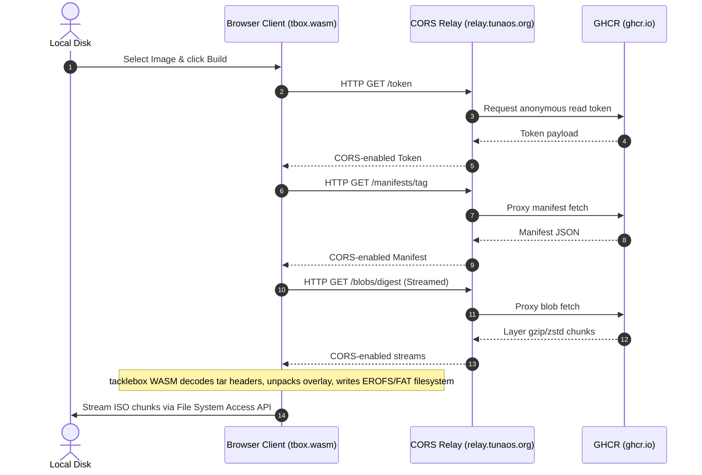

# TunaOS ISO Builder

Build a bootable **live ISO** from any bootable container image — **entirely in your browser**. No server, no upload: the same engine that CI uses ([tacklebox](https://github.com/tuna-os/tacklebox)) is compiled to WebAssembly and runs client-side.

**Live:** <https://iso.tunaos.org>

---

## The Intended Experience

1. **Pick a Base & Desktop:** Select your base (AlmaLinux Kitten, Fedora, Debian, etc.) and desktop environment (GNOME, KDE Plasma, COSMIC, Niri, XFCE).
2. **Instant Inspection:** The builder downloads metadata and inspects the image layers in seconds.
3. **Build ISO:** Click build, and a custom bootable ISO is streamed directly to your local storage.

Everything else — preloading Flatpaks, layering system packages ([remora](https://github.com/tuna-os/remora)), custom repos, or pointing to a custom registry relay — lives under **Advanced** and is entirely opt-in.

---

## How It Works (Architecture)

The builder is a **serverless, client-side application** designed to bypass traditional resource limitations when handling multi-gigabyte container images in web browsers:



### Key Technical Pillars
1. **Stateless CORS Relay (`worker/`):** Docker registries like GHCR do not emit browser `Access-Control-Allow-Origin` headers. The Cloudflare Worker shims the CORS preflight requests and adds edge caching (`cf: { cacheEverything: true }`) for immutable blob digests to absorb repeating downloads.
2. **Back-to-Front Tar Scanning:** Decodes layer tars in reverse order (topmost first) to identify the kernel and initramfs in seconds, enabling it to abort connection streams early rather than pulling gigabytes of unnecessary data.
3. **File System Access API Streaming:** Instead of buffering the final multi-gigabyte ISO in browser tab memory (which easily triggers OOM tab crashes), it streams chunks directly to disk via `showSaveFilePicker()`. Browsers without this support (Safari, Firefox) fall back to memory buffering with a warning.

---

## Layout

| Path | Description |
|------|-------------|
| `app/public/` | Static web application assets. `tbox.wasm` is tacklebox compiled for `GOOS=js GOARCH=wasm`. |
| `app/wrangler.jsonc` | Cloudflare Pages deployment configuration. Deployed to `iso.tunaos.org`. |
| `worker/` | `cors-shim.js` — Cloudflare Worker shim (`relay.tunaos.org`) proxying GHCR + Flathub/package search APIs. |
| `e2e/` | Playwright test suite driving the real WASM engine against live container registries. |
| `legacy/` | Original stage 1–3 prototype files (`erofs.js`, `scanner.js`, `unpack.js`) kept for reference. |

---

## Develop

```sh
# Serve the app locally
cd app/public && python3 -m http.server 8080   # → http://localhost:8080

# E2E Setup & Execution
cd e2e && npm ci && npx playwright install --with-deps chromium
npx playwright test --grep-invert @full        # Runs UI & inspect network flow
```

> [!IMPORTANT]
> Playwright tests run in a persistent browser context located in `~/tmp/` instead of `/tmp`. This ensures Chrome doesn't run out of storage space when downloading real image layers on Linux environments that limit `/tmp` to a small `tmpfs` RAM disk.

---

## Deploy

```sh
cd app    && npx wrangler deploy   # Deploys to Pages (iso.tunaos.org)
cd worker && npx wrangler deploy   # Deploys to Workers (relay.tunaos.org)
```

*Note: Requires `CLOUDFLARE_API_TOKEN` configured in your environment with Workers and Pages deployment scope.*

---

## Updating the WASM Engine

`app/public/tbox.wasm` is built from the [tacklebox](https://github.com/tuna-os/tacklebox) repository:

```sh
GOOS=js GOARCH=wasm go build -o tbox.wasm ./cmd/tbwasm
```

When updating the WASM file, always ensure you copy the matching `wasm_exec.js` from your Go installation:
```sh
cp "$(go env GOROOT)/lib/wasm/wasm_exec.js" app/public/
```
