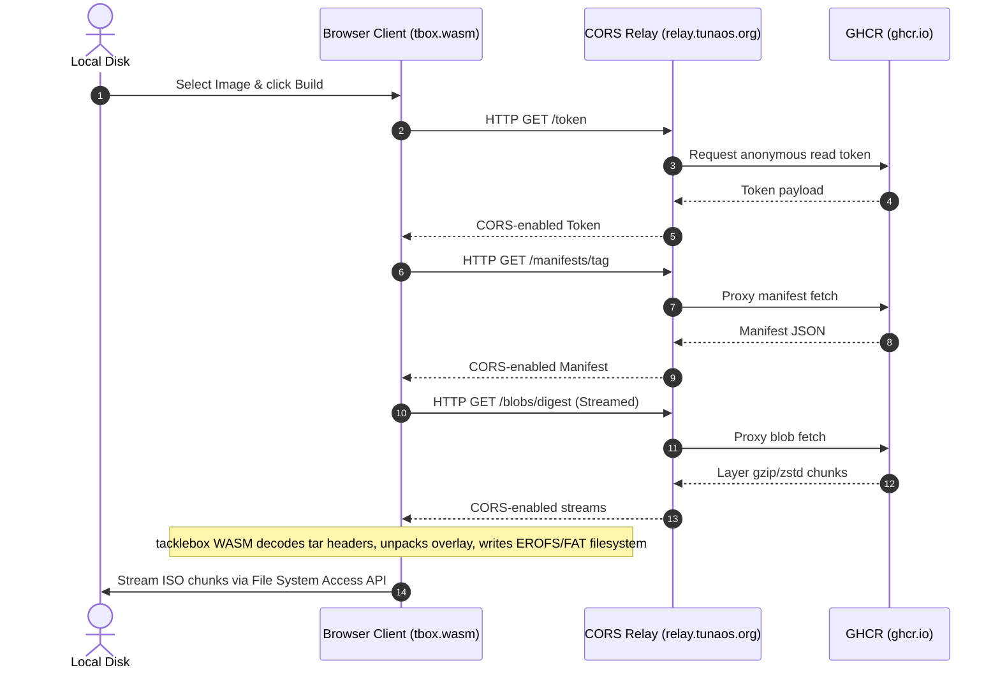

# TunaOS ISO Builder

Build a bootable **live ISO** from any bootable container image — **entirely in your browser**. No server, no upload: CI uses the same engine ([tacklebox](https://github.com/tuna-os/tacklebox)). We compile it to WebAssembly, and it runs client-side.

**Live:** <https://iso.tunaos.org>

---

## The Intended Experience

1. **Pick a Base & Desktop:** Select your base (AlmaLinux Kitten, Fedora, Debian, etc.). Then select a desktop (GNOME, KDE Plasma, COSMIC, Niri, XFCE).
2. **Instant Inspection:** The builder downloads metadata and inspects the image layers in seconds.
3. **Build ISO:** Click build. The builder streams a custom bootable ISO to your local storage.

All other options are under **Advanced**, and each one is opt-in. You can preload Flatpaks, add system packages ([remora](https://github.com/tuna-os/remora)), add custom repos, or set a custom registry relay.

---

## How It Works (Architecture)

The builder is a **serverless, client-side application**. Its design avoids the usual browser limits on memory and storage for multi-gigabyte container images:


```mermaid
sequenceDiagram
    autonumber
    actor User as Local Disk
    participant Browser as Browser Client (tbox.wasm)
    participant Relay as CORS Relay (relay.tunaos.org)
    participant Registry as GHCR (ghcr.io)

    User->>Browser: Select Image & click Build
    Browser->>Relay: HTTP GET /token
    Relay->>Registry: Request anonymous read token
    Registry-->>Relay: Token payload
    Relay-->>Browser: CORS-enabled Token
    Browser->>Relay: HTTP GET /manifests/tag
    Relay->>Registry: Proxy manifest fetch
    Registry-->>Relay: Manifest JSON
    Relay-->>Browser: CORS-enabled Manifest
    Browser->>Relay: HTTP GET /blobs/digest (Streamed)
    Relay->>Registry: Proxy blob fetch
    Registry-->>Relay: Layer gzip/zstd chunks
    Relay-->>Browser: CORS-enabled streams
    Note over Browser: tacklebox WASM decodes tar headers, unpacks overlay, writes EROFS/FAT filesystem
    Browser->>User: Stream ISO chunks via File System Access API
```

### Key Technical Pillars
1. **Stateless CORS Relay (`worker/`):** Docker registries (for example, GHCR) do not emit browser `Access-Control-Allow-Origin` headers. The Cloudflare Worker shims the CORS preflight requests. It also keeps an edge cache (`cf: { cacheEverything: true }`) of immutable blob digests to absorb repeat downloads.
2. **Back-to-Front Tar Scan:** The engine decodes the layer tars in reverse order (topmost first). It finds the kernel and initramfs in seconds. Then it stops the connection streams early, and does not pull gigabytes of unnecessary data.
3. **Stream to Disk:** The final ISO is multi-gigabyte. A browser tab can crash with OOM if it holds the full ISO in memory. So the engine streams the chunks to disk through `showSaveFilePicker()`. Browsers without this support (Safari, Firefox) keep the ISO in memory instead, and show a warning.

---

## Layout

| Path | Description |
|------|-------------|
| `app/public/` | Static web application assets. `tbox.wasm` is tacklebox compiled for `GOOS=js GOARCH=wasm`. |
| `app/wrangler.jsonc` | Cloudflare Pages deployment configuration. Deployed to `iso.tunaos.org`. |
| `worker/` | `cors-shim.js` — Cloudflare Worker shim (`relay.tunaos.org`) proxying GHCR + Flathub/package search APIs. |
| `e2e/` | Playwright test suite driving the real WASM engine against live container registries. |
| [`native/`](native/README.md) | Cross-platform desktop writer for creating and managing persistent multi-boot drives. |
| [`docs/`](docs/MULTI-BOOT-DRIVE-MANAGEMENT.md) | Design and lifecycle documentation for multi-boot drive management. |
| [`CONTRIBUTING.md`](CONTRIBUTING.md) | Developer guide, test suite instructions, and contribution process. |

---

## Develop

```sh
# Build the WASM engine first (not committed to git — see "Updating the WASM Engine")
GOOS=js GOARCH=wasm go build -o app/public/tbox.wasm ./cmd/tbwasm   # from the pinned tacklebox checkout
cp "$(go env GOROOT)/lib/wasm/wasm_exec.js" app/public/

# Serve the app locally
cd app/public && python3 -m http.server 8080   # → http://localhost:8080

# E2E Setup & Execution
cd e2e && npm ci && npx playwright install --with-deps chromium
npx playwright test --grep-invert @full        # Runs UI & inspect network flow
```

> [!IMPORTANT]
> Playwright tests run in a persistent browser context in `~/tmp/`, not in `/tmp`. Some Linux systems limit `/tmp` to a small `tmpfs` RAM disk. There, Chrome can run out of storage space when it downloads the layers of a real image.

### Native writer

The desktop writer has separate platform prerequisites and uses the Go toolchain.
See [`native/README.md`](native/README.md) for build and test commands, and
[`docs/MULTI-BOOT-DRIVE-MANAGEMENT.md`](docs/MULTI-BOOT-DRIVE-MANAGEMENT.md)
for the drive-management lifecycle and safety model.

---

## Deploy

```sh
cd app    && npx wrangler deploy   # Deploys to Pages (iso.tunaos.org)
cd worker && npx wrangler deploy   # Deploys to Workers (relay.tunaos.org)
```

*Note: You need `CLOUDFLARE_API_TOKEN` in your environment, with the Workers and Pages deployment scope.*

Normally this is automatic: the `deploy` job in `.github/workflows/ci.yml` deploys both surfaces on every push to `main`. CI does not check production after the deploy. Thus, do a manual check: `curl -sS https://relay.tunaos.org/healthz` (expects `{"status":"ok"}`) and `curl -sSI https://iso.tunaos.org/tbox.wasm`. For the rollback steps and the full checklist, see [`runbooks/deploy-and-rollback.md`](runbooks/deploy-and-rollback.md).

---

## Updating the WASM Engine

`app/public/tbox.wasm` is built from the [tacklebox](https://github.com/tuna-os/tacklebox) repository:

```sh
GOOS=js GOARCH=wasm go build -o tbox.wasm ./cmd/tbwasm
```

When you update the WASM file, always copy the matching `wasm_exec.js` from your Go installation:
```sh
cp "$(go env GOROOT)/lib/wasm/wasm_exec.js" app/public/
```

## Updating systemd-boot

`app/public/systemd-bootx64.efi` is a committed copy of the systemd-boot EFI
stub. The app fetches it at runtime for the DDI build path. We pin it to
one exact version of the Ubuntu package, with a checksum. For the provenance
and the pinned version, see
[`app/public/sdboot-NOTICE.txt`](app/public/sdboot-NOTICE.txt). That file also
has the command to verify or refresh the stub.
